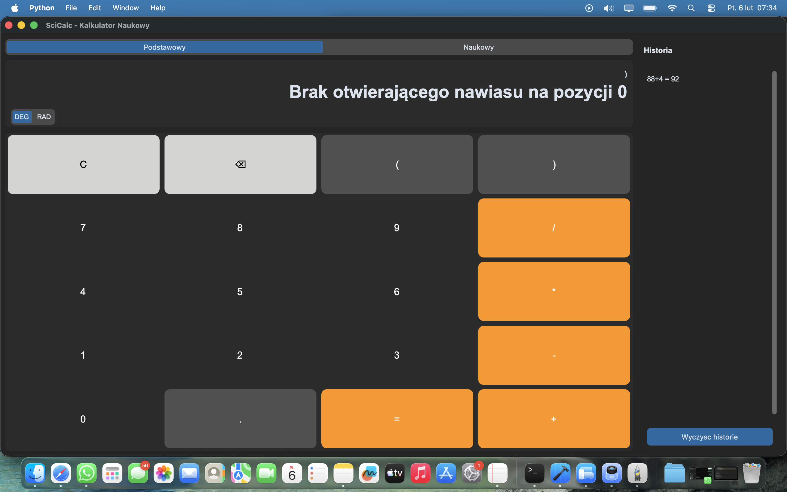
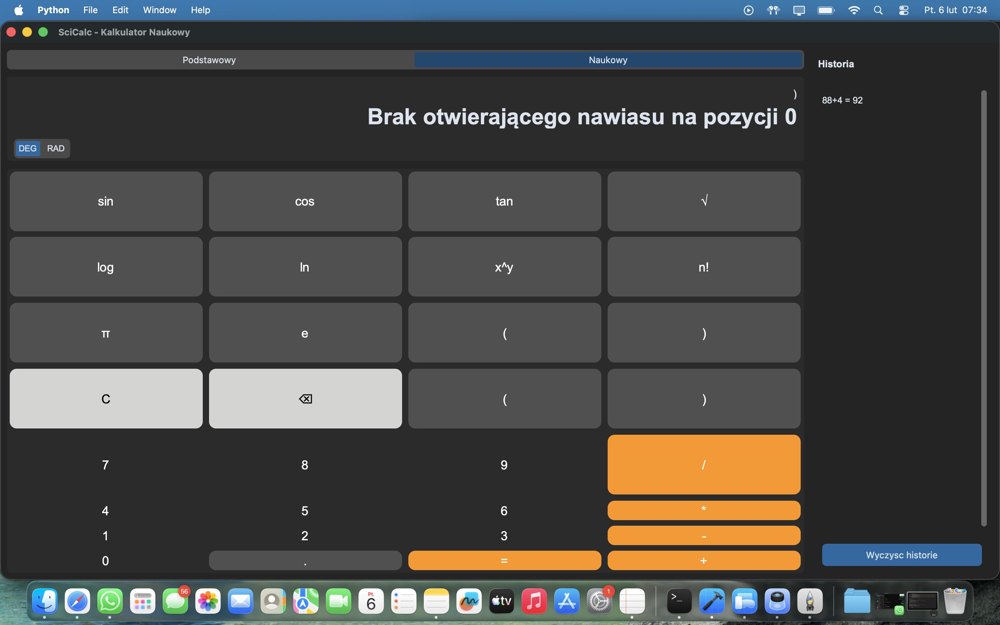
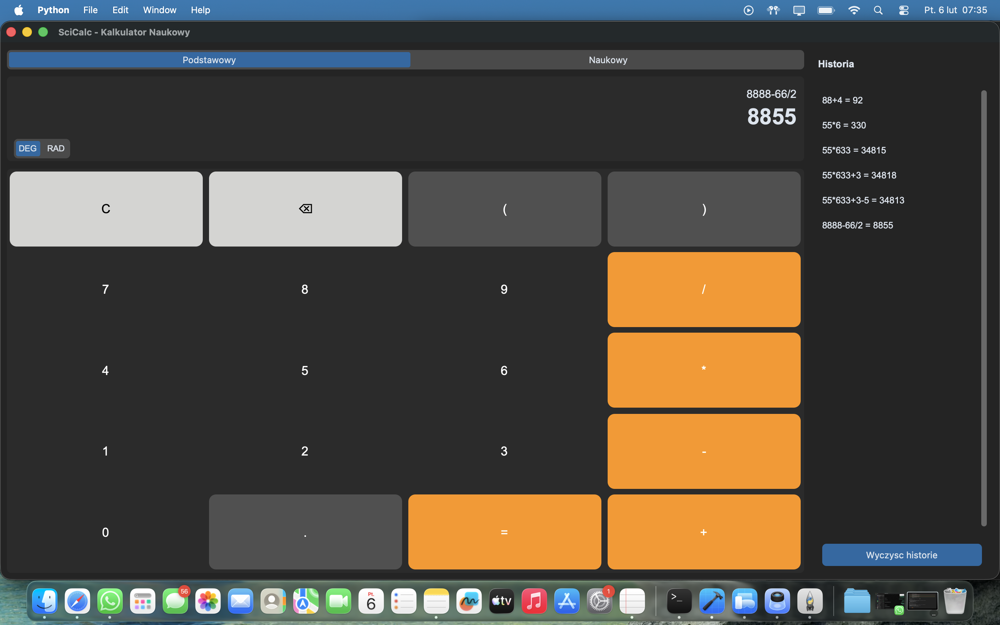

# SciCalc - Kalkulator Naukowy


## Opis

Profesjonalny kalkulator naukowy z nowoczesnym interfejsem w języku polskim. Aplikacja oferuje dwa tryby pracy (podstawowy i naukowy), ciemny motyw oraz panel historii obliczeń. Wszystkie obliczenia są wykonywane z wykorzystaniem bezpiecznej ewaluacji wyrażeń, co gwarantuje ochronę przed niebezpiecznym kodem.

## Funkcje

- Dwa tryby pracy: podstawowy i naukowy
- Funkcje naukowe: sin, cos, tan, sqrt, potęgowanie (x^y), logarytmy (ln, log10), silnia (n!)
- Stałe matematyczne: pi, e
- Panel historii obliczeń z możliwością ponownego użycia wyników
- Przełącznik trybu kątów DEG/RAD
- Obsługa klawiatury i schowka (Ctrl+C/V)
- Ciemny motyw z zaokrąglonymi przyciskami (CustomTkinter)
- Bezpieczna ewaluacja wyrażeń (simpleeval — bez eval())
- Precyzja obliczeń z użyciem modułu Decimal
- Polskie komunikaty błędów i interfejs

## Zrzuty ekranu


*Tryb podstawowy*


*Tryb naukowy z rozszerzonymi funkcjami*


*Panel historii z listą obliczeń*

## Instalacja

### Wymagania

- **Python 3.10 lub nowszy** (systemowy Python 3.9 na macOS nie jest wystarczający)
- pip (menedżer pakietów Python)
- System operacyjny: Windows, macOS, lub Linux

> **macOS:** Domyślny `python3` to często wersja 3.9, która nie obsługuje CustomTkinter.
> Zainstaluj nowszą wersję: `brew install python@3.12` i używaj `python3.12` zamiast `python3`.

### Kroki instalacji

1. Sklonuj repozytorium:
```bash
git clone https://github.com/selter2001/scicalc.git
cd scicalc
```

2. Utwórz wirtualne środowisko:
```bash
# macOS (z Homebrew Python):
python3.12 -m venv venv
source venv/bin/activate

# Linux:
python3 -m venv venv
source venv/bin/activate

# Windows:
python -m venv venv
venv\Scripts\activate
```

3. Zainstaluj zależności:
```bash
pip install -r requirements.txt
```

## Użycie

Uruchom kalkulator poleceniem:
```bash
python3 -m src.calculator.main
```

Otworzy się okno kalkulatora z ciemnym motywem. Możesz przełączać się między trybem podstawowym a naukowym za pomocą przycisku w dolnej części okna. Panel historii wyświetla wszystkie wykonane obliczenia i pozwala na szybkie ponowne użycie wyników.

## Skróty klawiszowe

| Klawisz      | Funkcja                  |
|--------------|--------------------------|
| 0-9          | Cyfry                    |
| +, -, *, /   | Operatory                |
| Enter        | Oblicz wynik             |
| Backspace    | Usuń ostatni znak        |
| Escape       | Wyczyść                  |
| Ctrl+C       | Kopiuj wynik             |
| Ctrl+V       | Wklej                    |

## Struktura projektu

```
src/calculator/
├── main.py           # Punkt wejścia aplikacji
├── config/           # Konfiguracja aplikacji i lokalizacja
│   ├── constants.py      # Stałe konfiguracyjne
│   └── locale.py         # Polskie komunikaty
├── logic/            # Logika kalkulatora i silnik obliczeń
│   ├── calculator.py     # Główny silnik (CalculatorEngine)
│   ├── evaluator.py      # Bezpieczna ewaluacja wyrażeń (SafeEvaluator)
│   └── validator.py      # Walidacja wyrażeń (InputValidator)
├── ui/               # Komponenty interfejsu użytkownika
│   ├── calculator_window.py  # Główne okno aplikacji
│   ├── display.py            # Panel wyświetlacza z DEG/RAD
│   ├── button_panel.py       # Panel przycisków
│   └── history_panel.py      # Panel historii obliczeń
└── controller/       # Kontroler MVC łączący logikę z UI
    └── calculator_controller.py
```

## Testy

Projekt zawiera 156 testów jednostkowych pokrywających silnik obliczeń, walidację wyrażeń i kontroler.

Uruchom testy:
```bash
pytest tests/
```

## Technologie

- **Python 3.10+** - język programowania
- **CustomTkinter** - nowoczesna biblioteka GUI
- **simpleeval** - bezpieczna ewaluacja wyrażeń matematycznych

## Licencja

Projekt dostępny na licencji MIT. Zobacz [LICENSE](LICENSE) dla szczegółów.

## Autor

Wojciech Olszak
